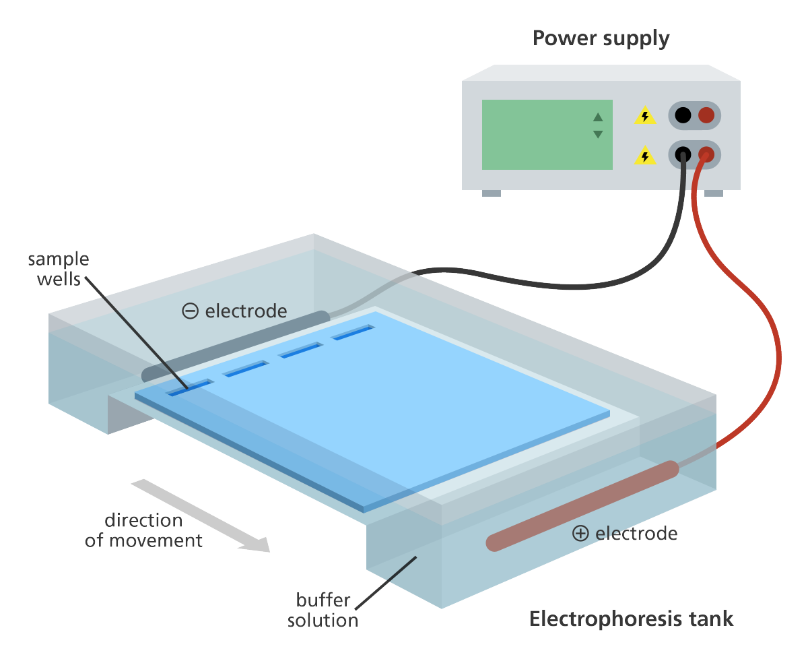
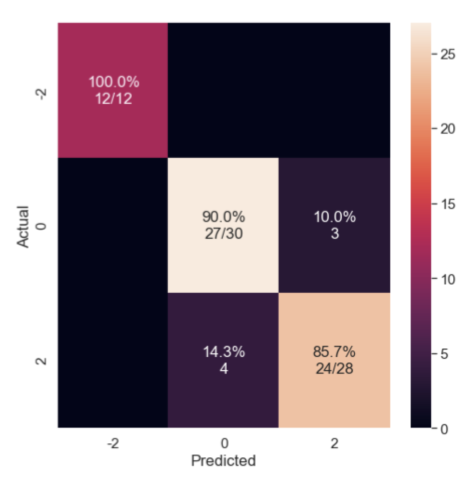

**A Machine Learning tool to assess Protein Quality**

Protein production is a multi-billion dollar business, and companies are trying to not only increase its production but also improve the quality.  Protein quality is commonly assessed using electrophoresis.  Gel electrophoresis is the experimental method to separate proteins into its fragments based on their size [see Figure-1]. 

<em>Figure 1: Gel electrophoresis experimental setup. 
When a voltage gradient is induced across a gel, the heavier proteins flow down the electric river much more slowly than the lighter ones.  These fragments show up under UV exposure as separated individual bands</em>

**Visual Inspection of Gels is laborious and expensive**

Scientists (generally more than one, see Figure-2) painstakingly examine each lane individually and give a quality score. Visual examination and labeling is painful and laborious; it is not an efficient use of resources having PhD level scientists doing this repetitively day after day.  On top of that, this process is quite expensive -- To give a rough estimate of costs, if a scientist does this for an 1/2 hour a day @ $100$/hr., 20 days/month, 12 month; the costs can add up to $25K for 2 labelers and add another $25K as lost time to do more interesting work, totalling to $50K, which is a lot of money.  This is the reason I built Inspector Machine Learning -- I wanted to determine how image analysis and machine learning could reduce the burden on scientists and help automate the quality inspection of gel images.

<em>Figure 2: Scientific personnel making visual examination of gel-lanes, often disagree.</em>

**Digitizing the dataset & building an image pre-processing pipeline**

I worked with a tiny dataset of measly 14 images; each image has 26 lanes (and usually one reference lane); and each lane had one or more bands [see Figure 2].  For my analysis, I needed to isolate the individual lanes and build a single training samples and associate it with their quality labels [Figure 2; quality labels in red].  In total, I had 14X25= 350 samples that were to be used for training/ validation and test.  Note: I did not use/rely on Reference lane information to build features etc. [but they are typically used by the quality assessors].

*I engineerding an image pre-processing pipeline to clean, extract and prepare the data for model building*

**Step 1**.	*Cropping + Perspective (affine) transformation of gel-images*
Manual cropping step was done to eliminate non-signal information from the image and align the image to a regular grid, extracting the region of interest (ie. gel lanes) as cleanly as possible.  Since the images are warped due to imaging setup, perspective transformation was performed on the entire image to straighten each lane as much as possible so that downstream analysis becomes easier.

**Step 2**.	*Extracted individual lanes using intensity gradients*
I implemented a custom function to strip the image into 26 equal sized columns using the leftmost and rightmost intensity markers. 

**Step 3**.	*Calculated 1D signal from pixel columns*
This was perhaps the most important step in the analysis since it converted the columnar lane matrix into a 1D array signal using simple sums and averages of pixel intensities. 
 
**Step 4**	*Generated phase-shifted signals with different lags*
Since I wasn’t able to completely get rid of the curvature from images [in Step 1]-- I compensated for this problem by doing data augmentation.  I implemented custom functions to calculate autocorrelated signals (with both positive and negative lags); and was able to increase the size of the training dataset 7-X.

[**Fig. 3:** *Image processing pipeline to digitize the data.*]

**Modeling and developing the core of Inspector-ML** 

With the dataset prepared; a computer vision pipeline engineered,  I prototyped several machine learning models. 

**A.	Linear models**
I started simple -- applied the family of Logistic Regression models to the problem.  Augmentation did not help the linear models due to their inability to be flexible in fitting the data.

**B.	Non-linear models capture relationships that simple linear models don’t**
While both types of models can fit the curvature of the 1D signals (Step 3 in the pipeline), decision trees are able to discover novel structural relationships in the signal that linear models aren’t able to capture. Random Forests being much more flexible in the shapes of the curves that it can fit benefitted a lot from data augmentation.

[**Fig. 4:** *Classification with Random Forest Model with no augmentation; mean accuracy= 70%.*]

[**Fig. 5:** *Signal Augmentation Improves Classification with Random Forest Model with augmentation with mean accuracy= 90%.*]

**C.	Validating the Models**
I validated this pipeline on a held-out set of data. The algorithm performed well above chance in correctly identifying images of each class.  Here I am showing a confusion matrix, with the proportion of images in each category predicted to belong to each category. The strong diagonal reflects successful classification.

**Major Takeaways** 
*Inspector-ML positively impacts the Bottomline*

1.	Machine Learning can effectively perform this task & automation removes much of the subjectivity of manual interpretation of band positions and sizes.

2.	Scientists can use their time more effectively -- frees up 6 weeks of productive time.  (½  hour X 250 working days) X 2 scientists ⇒ 250 man-hours/year. 

[**Fig. 6:** *Built ML tool that successfully predicts quality scores for each lane*]

**Code**
The code for this project is publicly available on my GitHub (https://github.com/jain-rish/inspector_ML)

